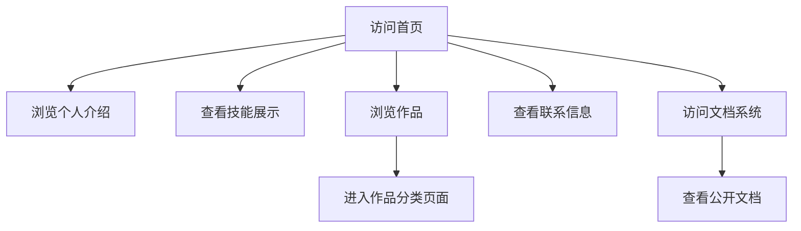
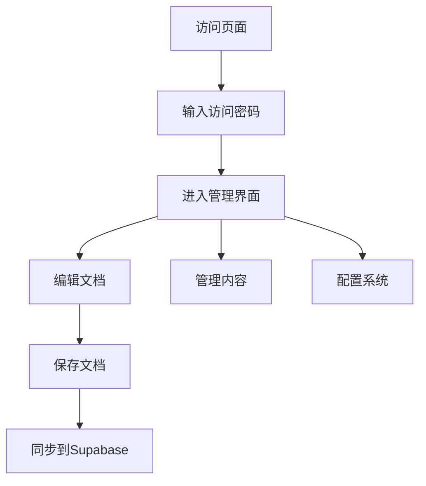

# Weatheraintbad.com 产品需求文档

## 1. 产品概览

Weatheraintbad.com 是一个集个人作品集展示、文档管理系统和数据可视化于一体的综合性个人网站。它采用现代化设计理念，提供响应式布局、主题切换和丰富的动画效果，帮助用户展示个人技能、作品和文档。

- **产品定位**：个人作品集+文档管理系统+数据可视化平台
- **目标用户**：个人开发者、设计师、内容创作者
- **解决问题**：提供一个统一的平台展示个人作品、管理文档和可视化数据

## 2. 核心功能

### 2.1 用户角色

| 角色 | 注册方式 | 核心权限 |
|------|----------|----------|
| 访客 | 无需注册 | 浏览所有公开内容、查看作品、阅读文档 |
| 管理员 | 密码验证 | 编辑文档、管理内容、配置系统 |

### 2.2 功能模块

Weatheraintbad.com 包含以下主要功能模块：

#### 2.2.1 首页 - 个人作品集展示

**功能描述**：展示个人信息、技能、作品和联系信息的首页。

**详细功能**：
- 个人介绍：姓名、头像、职业描述
- 技能展示：技能分类和标签
- 作品展示：网格布局展示各类作品
- 联系信息：社交链接、邮箱、联系方式
- 响应式设计：适配不同屏幕尺寸
- 主题切换：支持深色/浅色主题
- 滚动动画：滚动触发的淡入和缩放效果
- 导航栏：固定导航栏，滚动时样式变化

#### 2.2.2 文档管理系统

**功能描述**：完整的文档管理和编辑系统，支持Markdown格式和Supabase存储。

**详细功能**：
- 文档列表：分页展示所有文档
- 文档搜索：实时搜索文档标题和内容
- 文档编辑：Markdown编辑器，支持实时预览
- 文档预览：渲染Markdown内容
- 文档分享：生成分享链接
- 密码保护：页面访问密码验证
- 离线存储：本地存储文档副本
- 数据库操作：Supabase后端存储和管理

#### 2.2.3 作品展示页面

**功能描述**：分类展示各类作品的页面。

**详细功能**：
- 设计作品：平面设计、UI/UX设计
- 前端开发：Web应用、组件库
- 视频作品：视频剪辑、动画
- 营销页面：营销活动页面
- 产品设计：产品原型、用户研究
- Mod开发：游戏Mod开发
- 博客页面：技术博客和文章

#### 2.2.4 数据看板

**功能描述**：数据可视化和分析页面。

**详细功能**：
- 图表展示：各类数据图表
- 数据统计：关键指标统计
- 实时更新：数据实时刷新
- 响应式图表：适配不同屏幕尺寸

#### 2.2.5 系统功能

**功能描述**：系统级功能和安全机制。

**详细功能**：
- 主题系统：深色/浅色/跟随系统主题
- 响应式布局：适配移动端、平板、桌面端
- 动画效果：页面加载、滚动、交互动画
- 安全机制：页面访问密码、文档编辑密码
- 反调试：防止代码调试和篡改
- 本地存储：浏览器本地存储数据

## 3. 核心流程

### 3.1 访客浏览流程



### 3.2 管理员操作流程



## 4. 用户界面设计

### 4.1 设计风格

- **主色调**：橙色 (#faa755)
- **辅助色**：黑色、白色、灰色系
- **设计语言**：现代化、简约、渐变效果
- **动画风格**：流畅的过渡和悬停效果
- **字体**：Inter（英文）、Noto Serif SC（中文）

### 4.2 响应式设计

| 设备类型 | 屏幕尺寸 | 布局特点 |
|----------|----------|----------|
| 移动端 | ≤768px | 单列布局，优化触摸交互 |
| 平板 | 768px-1024px | 双列布局，平衡内容密度 |
| 桌面端 | ≥1024px | 多列布局，最大化内容展示 |

### 4.3 主要页面设计

#### 4.3.1 首页设计

- **顶部导航**：固定导航栏，包含logo和菜单
- **Hero区域**：大标题、副标题、CTA按钮
- **技能展示**：技能标签和分类
- **作品展示**：网格布局的作品卡片
- **联系区域**：社交链接和联系信息

#### 4.3.2 文档管理系统设计

- **侧边栏**：文档分类和菜单
- **主内容区**：文档列表和搜索
- **编辑器**：Markdown编辑器和预览
- **工具栏**：保存、分享、导出等功能

## 5. 技术架构

### 5.1 前端技术栈

- **HTML5**：语义化页面结构
- **CSS3**：现代样式和动画
- **JavaScript ES6+**：交互逻辑
- **Google Fonts**：字体资源
- **CSS Grid & Flexbox**：响应式布局
- **CSS Variables**：主题系统

### 5.2 后端技术栈

- **Supabase**：数据库和认证服务
- **PostgreSQL**：关系型数据库
- **JWT**：用户认证
- **CORS**：跨域资源共享

### 5.3 存储方案

- **图片存储**：GitHub仓库和CDN
- **文档存储**：Supabase数据库
- **配置存储**：本地存储和环境变量

## 6. 数据结构

### 6.1 文档数据结构

```json
{
  "id": "uuid",
  "title": "文档标题",
  "content": "Markdown内容",
  "created_at": "创建时间",
  "updated_at": "更新时间",
  "published": "是否公开",
  "password": "访问密码"
}
```

### 6.2 作品数据结构

```json
{
  "id": "uuid",
  "title": "作品标题",
  "description": "作品描述",
  "category": "分类",
  "image": "封面图片",
  "link": "作品链接",
  "tags": ["标签1", "标签2"]
}
```

## 7. 安全需求

### 7.1 访问控制

- 页面访问密码保护
- 文档编辑密码验证
- 敏感操作权限控制

### 7.2 数据安全

- 文档内容加密存储
- 用户输入验证
- SQL注入防护

### 7.3 反调试

- 防止代码调试
- 右键菜单限制
- 文本选择限制

## 8. 性能优化

### 8.1 加载优化

- 图片懒加载
- 资源压缩和优化
- 响应式图片加载

### 8.2 渲染优化

- 动画性能优化
- DOM操作优化
- 代码分割

### 8.3 缓存策略

- 浏览器缓存
- CDN缓存
- 本地存储

## 9. 未来规划

### 9.1 短期规划（1-3个月）

- 添加博客功能
- 优化文档搜索体验
- 增强响应式设计

### 9.2 中期规划（3-6个月）

- 增加多语言支持
- 集成更多社交平台
- 优化性能和安全性

### 9.3 长期规划（6-12个月）

- 添加用户评论系统
- 集成数据分析功能
- 开发移动端应用

## 10. 风险评估

### 10.1 技术风险

- 依赖第三方服务（Supabase）
- 浏览器兼容性问题
- 网络连接稳定性

### 10.2 安全风险

- SQL注入攻击
- XSS攻击
- 密码破解风险

### 10.3 运维风险

- 服务器稳定性
- 数据备份和恢复
- 域名和SSL证书管理

## 11. 附录

### 11.1 配置文件

- `SUPABASE_CONFIG.md`：Supabase配置指南
- `FIX_PUBLISHED_FIELD.md`：数据库字段修复说明

### 11.2 开发说明

- 使用VSCode进行开发
- 遵循ESLint和Prettier规范
- 使用Git进行版本控制

### 11.3 部署说明

- 使用GitHub Pages部署
- 配置CNAME文件
- 启用HTTPS